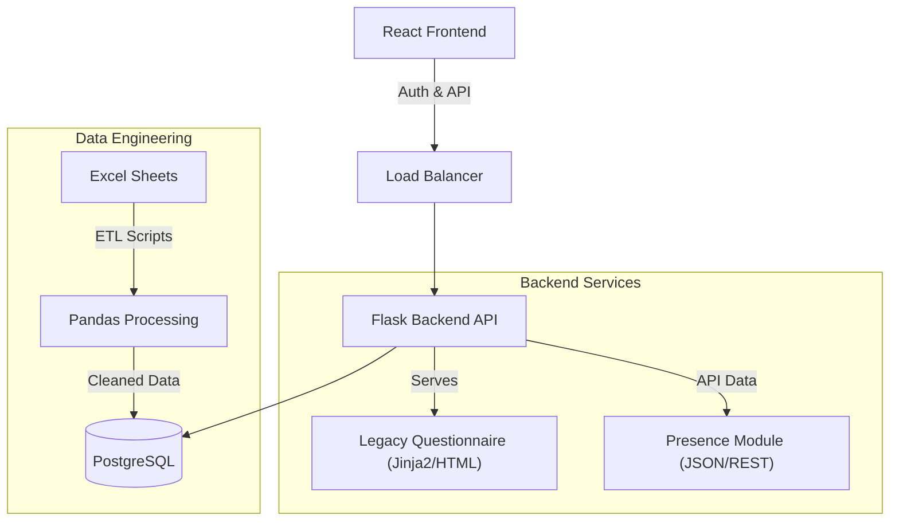

# Social Data Management Platform

A portfolio version of a full-stack hybrid application designed for managing interactions, attendance, and demographic data for social assistance programs. This project demonstrates the evolution from a legacy system to a modern web architecture, integrating data analysis pipelines with a robust user interface.

> **Note**: This repository is a sanitized version of a production application. Sensitive data, keys, credentials, and PII (Personally Identifiable Information) have been redacted or removed.

## 📖 Project Overview

This application manages the full lifecycle of beneficiary data for a social project. It operates on a **hybrid architecture** that bridges legacy systems with modern development practices:

-   **The Legacy Core (Flask)**: Originally, the system was a standalone Flask application used for field research, specifically collecting socioeconomic data via complex questionnaires. This "Legacy" module is still active and integral for deep data collection.
-   **The Modern Platform (React/Vite)**: As requirements evolved to include attendance tracking ("Aplicação de Presença"), the system was modernized. The React frontend now handles the public interface, authentication, and the new interactive features.
-   **Hybrid Flow**: Users access the public React application. Upon authentication, they gain access to a unified portal that seamlessly integrates the **Legacy Questionnaire** and the modern **Presence & Activity Management** modules.

## Tech Stack & Skills

### Core Development
-   **Frontend**: React (Vite), TypeScript, TailwindCSS for responsive and modern UI/UX.
-   **Backend**: Python (Flask) acting as the orchestrator and legacy host.
-   **Database**: PostgreSQL (hosted on Google Cloud SQL), designed with complex relationships for family and demographic linking.
-   **Infrastructure**: Google App Engine, Google Secret Manager.

### Data Analysis & Engineering
The `data_analysis/` folder showcases scripts and ETL (Extract, Transform, Load) capabilities used to migrate and sanitize data from Excel spreadsheets and legacy databases into the production SQL environment.
-   **Tools**: Python, Pandas, NumPy, SQLAlchemy.
-   **Techniques**: Data cleaning, normalization, duplicate detection, and automated migration pipelines.

## Architecture

---
*Developed by Guilherme Juncal - Data Scientist & Full Stack Developer*

